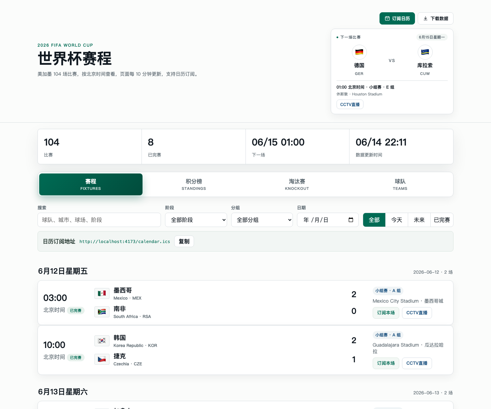

# 2026 FIFA World Cup Schedule

一个面向中文用户的 2026 世界杯赛程站点，包含赛程列表、小组积分、淘汰赛视图、球队资料和 iCalendar 订阅。

## 项目预览



项目可以作为纯静态站点部署，也可以搭配 Cloudflare Worker 定时刷新 FIFA 官方赛程数据。静态兜底文件由构建脚本生成：

- `public/schedule.json`
- `public/knockout.json`
- `public/calendar.ics`
- `public/matches/match-*.ics`

## 本地运行

```bash
npm install
npm run build
npm run dev
```

启动后访问本地静态服务输出的地址。

## 配置

构建静态数据时可以通过环境变量设置公开域名，该值会写入 JSON 的 `canonicalHost` 和 ICS 的 `PRODID`/`UID`：

```bash
PUBLIC_CANONICAL_HOST=example.com npm run build
```

如果页面需要读取独立部署的 Worker，请在构建时设置：

```bash
PUBLIC_WORKER_BASE_URL=https://your-worker.your-subdomain.workers.dev npm run build
```

留空时页面会从当前站点读取静态 JSON/ICS 文件。

Cloudflare Pages 部署时如果配置了 `PUBLIC_WORKER_BASE_URL`，Pages Functions 会把
`/schedule.json`、`/knockout.json`、`/calendar.ics` 和 `/matches/match-*.ics`
代理到 Worker，因此同域名下的数据地址也会跟随 Worker 自动刷新。

## 部署

完整流程见 [DEPLOYMENT.md](./DEPLOYMENT.md)。

常用命令：

```bash
npm run test
npm run worker:dev
npm run worker:deploy
```

## 数据来源

- FIFA 官方赛程：https://www.fifa.com/en/tournaments/mens/worldcup/canadamexicousa2026/scores-fixtures
- 中文赛程参考：https://m.dongqiudi.com/article/5543600.html
